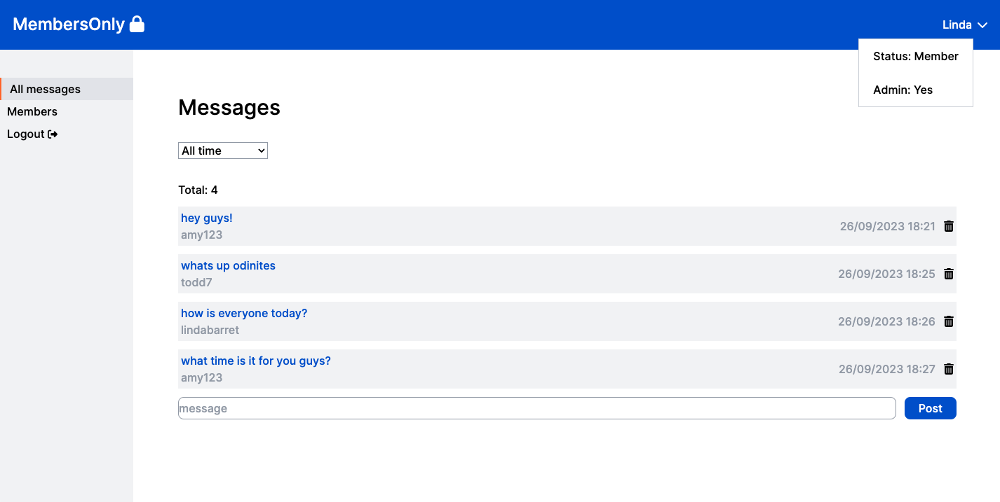

# Members Only

## [Live Demo](http://members-only-erinsophie.netlify.app)

### Admin view

### User view

## Technologies

- Frontend: React, Tailwind
- Backend: Node, Express, MongoDB

## Goal

To create a message board app that grants different permissions to different users based on membership status.

## Permissions

- Non-logged in users will see messages only
- Logged-in users will be able to see and post messages
- Members will be able to see all messages, including the username and timestamp, as well as be able to post messages
- Members who are admins will have the ability to delete any message if they so wish, as well as assign other members to be an admin as well with a toggle feature

## Features

- Passwords are hashed using bcryptjs (salt round of 10)
- Upon login, Passportjs is used to verify that the username and password exist in the database 
- Once a user successfully logs in, a session is started server-side
- The password and email are excluded from being stored in the session for added security 
- Validation and sanitation is performed on form fields using express-validator to provide server-side feedback messages
- To become a member, a user must enter the secret code ('The Odin Project')
- A list of members is available along with their admin status
- Messages can be filtered by today, this week or all time using date-fns

